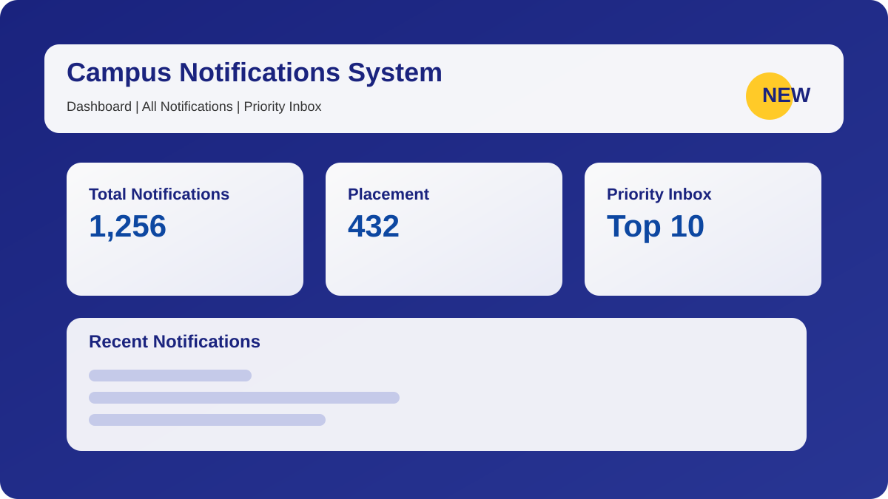

# Campus Notifications System Documentation

## Overview

This repository contains a production-grade Campus Notifications frontend built with React, Vite, JavaScript, Material UI, Axios, and React Router.



The app provides:
- Dashboard statistics
- All notifications browsing
- Priority Inbox with top-N selection
- Viewed/unviewed notification tracking
- Comprehensive logging across the frontend
- Responsive UI across desktop, tablet, and mobile

## Folder Structure

```
notification_app_fe/
├── src/
│   ├── components/
│   │   ├── layout/
│   │   │   ├── Header.jsx
│   │   │   ├── Sidebar.jsx
│   │   │   └── MainLayout.jsx
│   │   ├── notification/
│   │   │   └── NotificationCard.jsx
│   │   └── common/
│   │       ├── AlertBanner.jsx
│   │       ├── NotificationFilter.jsx
│   │       ├── PaginationComponent.jsx
│   │       ├── SkeletonLoader.jsx
│   │       └── StatisticsCard.jsx
│   ├── contexts/
│   │   └── NotificationContext.jsx
│   ├── hooks/
│   │   └── useNotifications.js
│   ├── middleware/
│   │   └── logger.js
│   ├── pages/
│   │   ├── DashboardPage.jsx
│   │   ├── NotificationsPage.jsx
│   │   └── PriorityInboxPage.jsx
│   ├── services/
│   │   ├── apiClient.js
│   │   └── notificationService.js
│   ├── utils/
│   │   ├── formatUtils.js
│   │   ├── paginationUtils.js
│   │   ├── priorityUtils.js
│   │   └── storageUtils.js
│   ├── App.jsx
│   ├── main.jsx
│   ├── theme.js
│   └── index.css
├── README.md
├── package.json
├── vite.config.js
└── .env.example
```

## Key Features

- **Logging Middleware**: Structured, session-based JSON logs for API requests/responses/errors, navigation, filters, search, pagination, and notification actions.
- **Priority Inbox**: Notifications sorted by type weight and recency.
- **Viewed States**: Viewed notification IDs saved to `localStorage` and displayed with muted appearance.
- **Responsive UI**: Material UI responsive grid, app bar, drawer, cards, and skeleton loading.
- **Error Handling**: User-friendly errors for network issues, invalid responses, and empty data.

## Logging Middleware

The logging middleware is implemented in `src/middleware/logger.js`.

### Functions
- `logInfo()`
- `logError()`
- `logWarning()`
- `logDebug()`
- `logApiRequest()`
- `logApiResponse()`
- `logNavigation()`
- `logFilter()`
- `logSearch()`
- `logPagination()`
- `logUserAction()`
- `logNotificationView()`
- `logPerformance()`

### Log Format

```json
{
  "timestamp": "2026-06-03T10:00:00.000Z",
  "sessionId": "session_1234567890",
  "level": "INFO",
  "category": "API",
  "event": "API_REQUEST",
  "message": "GET /notifications",
  "metadata": {
    "params": { "page": 1, "limit": 10 },
    "headers": { "Content-Type": "application/json" }
  }
}
```

## API Integration

### Base URL

`http://4.224.186.213/evaluation-service/notifications`

### Supported Query Parameters

- `page`
- `limit`
- `notification_type`

### Notification Types

- `Placement`
- `Result`
- `Event`

### Service Layer

- `src/services/apiClient.js` handles Axios configuration and interceptors.
- `src/services/notificationService.js` wraps the notifications API.

## Priority Inbox Logic

Weights:
- `Placement = 3`
- `Result = 2`
- `Event = 1`

Priority score calculation uses the type weight plus recency and sorts by score.

Top N options available: `10`, `15`, `20`.

## Viewed / Unviewed Notifications

Viewed notifications are tracked in `localStorage` under `viewedNotificationIds`.

When the user clicks a notification:
- the notification is marked as viewed
- the ID is stored in `localStorage`
- the UI updates to muted appearance and hides the `NEW` badge

## Running the Application

### Prerequisites

- Node.js 14.x or higher
- npm 6.x or higher

### Commands

```bash
cd notification_app_fe
npm install
npm run dev
```

Then open `http://localhost:3000`.

## Verification

### GitHub Push
- Repository URL: `https://github.com/SHIVAM-DHANKANI11/2330652`
- Latest commit pushed successfully.

### Current State
- Application files present and structured correctly.
- Logging middleware present and integrated across the app.
- Priority inbox implemented.
- Viewed/unviewed feature implemented.

## Notes

The app could not be run in this environment because `node` and `npm` were not available. Once Node is installed, the app should start normally with `npm run dev`.
